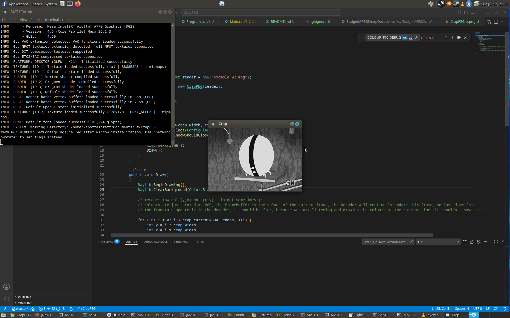

# CRAPPEG 
- THE WORST MPEG 1 DECODER ON EARTH

# Demo

# About
This is pretty much just a direct port of this old-ass branch of JSMPEG, https://github.com/phoboslab/jsmpeg/tree/42d572060835582aae4f59292d5a29ac09eece08,
this is a rewrite of my orginal one which was just weirdly designed by me. If you want to see the source code for V1, look in the V1 folder, it is
pretty much the same but weirdly designed.

They're many issues if anyone could help me, and fix it, and make a pull request, I would very very very much appricate, becaue I have been stuck for months
(on and off).

This exsits because I love video codec and wanted to make my own decoder, they're far better MPEG-1 decoders for real use, PL_MPEG or whatever
port to C# exsits, I forgot where though.

V1 is the name of the orginal port, it is designed weirdly AND IS COMMENTED TO HELL, this one is MUCH less.

No 'AI' was used in the making of this, as I don't really like 'AI', and this also just a port job, and also I am pissed at 'ai' because of the envieremnt
and making google a pain in the ass to use. No I do not not care about your 'AI overview' I just want to find a website with my answer.

I used Raylib for output, but anything will work.

Most of the credit has to be to anyone who worked on JS-MPEG, since this is a port really (espically v2).

# Major Issues
~~- Videos are in greyscale, this is due to me being an idiot and not knowing how to combine the luma and chroma arrays, I have spent SOOOO long on it, if anyone
can help that would be awsome.~~ 
- Videos with interframes (a GOP-Size of more than 1) are broken, cause crashes. Encode with 'ffmpeg -i input.mp4 -f mpeg1video -g 1 -q:v 1 -vf "crop=iw-mod(iw\,2):ih-mod(ih\,2)" example.mpg` to be safe. It breaks in the decode block and saved from fully crashing in a if statmet.
- This is hella unoptimized, yeah HD video ain't gonna work well, I AM AN AWFUL PROGRAMMER. Videos work best at 240p, VCD res (hey thats MPEG-1 was built for).
- All other issues from this built of JMPEG (expect resultion, I handle video displaying differently so maybe).
- No audio (but this is the same for JSMPEG of the time).
